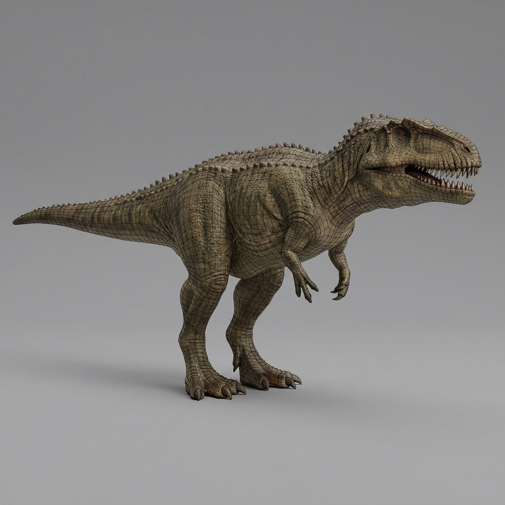

# Giganotosaurus

**Author**: Community

## Prompt

Giganotosaurus 3D character model, full body, T-pose, symmetrical.
Accurate scale and proportions based on paleontological references.
Clean quad topology, animation-ready rigging friendly.
PBR textures: albedo, roughness, metallic, normal, displacement.
High-resolution skin details, scales and wrinkles optimized for close-up rendering.
Neutral HDRI lighting, gray background.
Game / film production quality, Unreal Engine / Unity compatible.
No background environment, isolated model.

## Process

1. **Generation**:
    - **Tool**: Meshy AI
    - **Method**: Text to 3D
    - **Output**: Direct 3D model generation.
    

## Files

- **Preview Image**: [giganotosaurus.png](giganotosaurus.png)
- **3D Model**: [giganotosaurus.glb](giganotosaurus.glb)

## Preview Link

[View 3D Model](giganotosaurus.glb)

