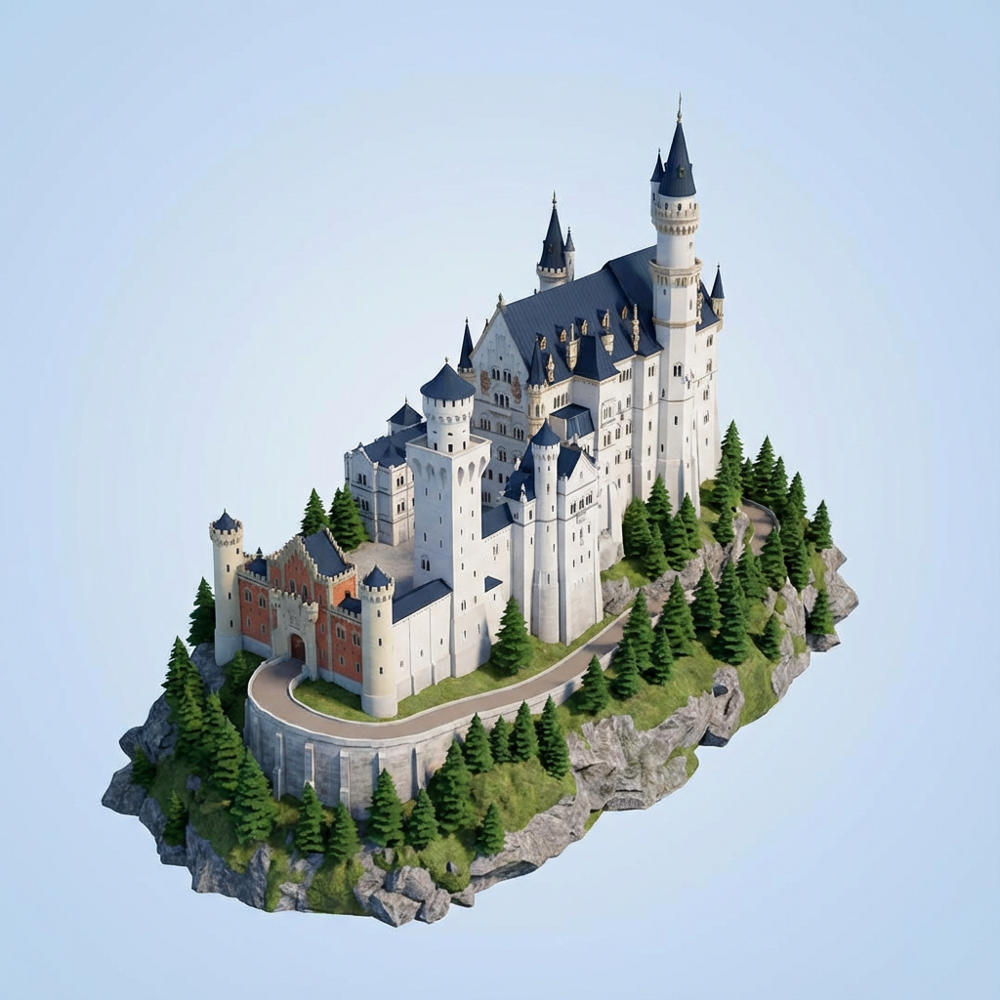

# Neuschwanstein Castle (新天鹅堡)

## Prompt

**中文**: 新天鹅堡
**English**: Neuschwanstein Castle

## Process

1. **Image Generation**:
    - **Tool**: Meshy AI (Text to Image)
    - **Prompt**: 新天鹅堡
    - **Output**: Reference Image

    

2. **3D Generation**:
    - **Input**: The generated image above.
    - **Tool**: Meshy AI (Image to 3D)

## Files

- **Reference Image**: [Neuschwanstein-Castle.png](Neuschwanstein-Castle.png)
- **Meshy AI Model**: [Neuschwanstein-Castle.glb](Neuschwanstein-Castle.glb)

## Preview Link

[View 3D Model (Meshy AI)](Neuschwanstein-Castle.glb)

