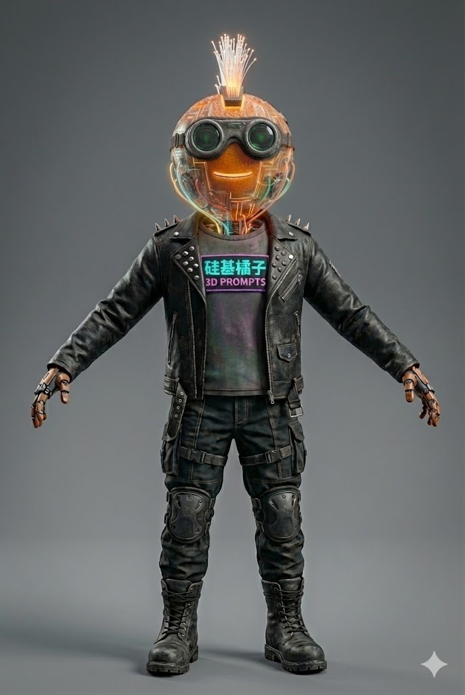

# SiliconOranges

**Author**: [@SiliconOranges](https://x.com/SiliconOranges)

## Prompt

{
  "prompt_description": "A highly detailed photograph of the 3D character 'Silicon-Based Orange' (硅基橘子) in a symmetrical A-pose, optimized to match the specific facial glow and material textures of the reference image (image_58.png).",
  "aspect_ratio": "2:3",
  "overall_style": "Ultra-photorealistic 3D character photograph, high-end Octane/Redshift render. Dramatic, high-contrast cinematic lighting emphasizes textures and the strong glow from the head.",
  "pose_and_setting": "A single, full-body photograph facing forward in a symmetrical A-pose against a clean, neutral grey seamless studio background.",
  "head": {
    "structure": "A highly transparent, spherical mechanical head with a clear, textured orange peel shell.",
    "face_glow": "The central feature is a brightly glowing yellow neon tube smiley face (two dots and a curved line), which is prominent and casts a strong warm glow onto the surrounding internal gears and the jacket collar.",
    "internal_details": "Intricate, sharply defined internal clockwork gears, copper wiring, and circuit boards pulsing with warm orange and cyan light are clearly visible through the shell.",
    "hair": "A dense mohawk of fiber optic strands, glowing from fiery orange at the base to bright white at the tips.",
    "eyewear": "Steampunk goggles with thick green lenses, weathered brass frames, and worn brown leather straps buckled on the head."
  },
  "torso": {
    "outerwear": "A heavily distressed black leather punk biker jacket. The leather has deep creases, significant scuffs, and worn edges, with highly polished metal studs on the lapels.",
    "chest_patch": "A prominent, glowing rectangular neon patch centered on the chest, reading '硅基橘子' in bright cyan neon characters above '3D PROMPTS' in purple neon letters.",
    "innerwear": "A dark, textured cotton t-shirt."
  },
  "arms_and_hands": {
    "hands": "Skeletal, fully mechanical articulated cyborg hands made of weathered brass and dark steel components."
  },
  "legs_and_feet": {
    "pants": "Dark grey tactical cargo pants with multiple straps, buckles, and hard-shell tactical knee pads showing scuffed plastic and metal textures.",
    "footwear": "Heavy, chunky, worn black leather combat boots with thick rubber soles and visible lacing."
  }
}

## Process

1. **Image Generation**:
    - **Tool**: Gemini / Midjourney
    - **Output**: Generated the reference image.
    

2. **3D Generation**:
    - **Input**: The generated image above.
    - **Tool 1**: Hunyuan 3D
    - **Tool 2**: Meshy AI

## Preview Link

[View 3D Model (Hunyuan 3D)](SiliconOranges-hunyuan.glb) | [View 3D Model (Meshy AI)](SiliconOranges-meshy.glb)
