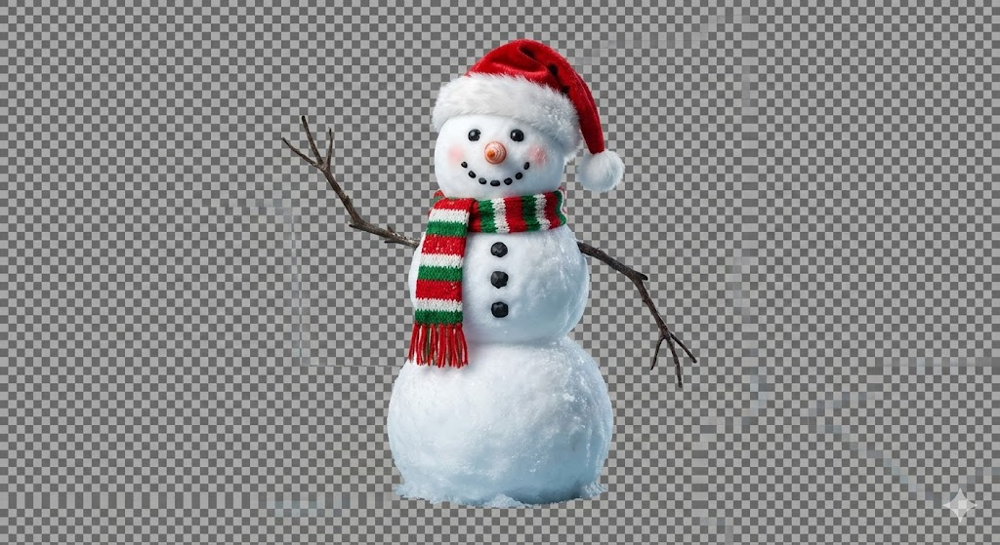

# Christmas Snowman

**Author**: Community

## Prompt

{
  "prompt_type": "Christmas Snowman",
  "scene_description": {
    "season": "Winter",
    "holiday": "Christmas",
    "time_of_day": "Neutral studio lighting",
    "weather": "No environmental effects",
    "mood": "Clean, cheerful, festive",
    "lighting": {
      "primary": "Soft, even studio light",
      "secondary": "Subtle cool fill light",
      "effects": "Clean shadows, no environmental glow"
    },
    "background": {
      "type": "Transparent",
      "description": "No background, isolated subject, alpha channel"
    }
  },
  "snowman": {
    "overall_structure": {
      "composition": "Three stacked snow spheres",
      "proportions": "Small head, medium torso, large base",
      "material": "Fresh, compacted snow with visible ice crystals",
      "surface_detail": "Hand-packed texture, tiny dents, slight melting at edges",
      "realism_level": "High"
    },
    "head": {
      "shape": "Smooth, nearly perfect sphere",
      "texture": "Fine-grained snow with soft highlights",
      "eyes": {
        "material": "Coal",
        "shape": "Small rounded stones",
        "color": "Deep matte black",
        "placement": "Evenly spaced, slightly asymmetrical for charm",
        "expression": "Friendly and lively"
      },
      "nose": {
        "material": "Carrot",
        "shape": "Tapered cone, slightly curved",
        "color": "Bright natural orange",
        "detail": "Organic grooves, lightly frosted surface"
      },
      "mouth": {
        "material": "Small coal pieces",
        "shape": "Gentle curved smile",
        "emotion": "Cheerful and welcoming"
      },
      "cheeks": {
        "detail": "Subtle rosy tint"
      },
      "hat": {
        "type": "Santa hat",
        "material": "Soft velvet fabric",
        "primary_color": "Bright Christmas red",
        "trim": {
          "material": "Fluffy white fur",
          "texture": "Soft, thick, slightly uneven fibers"
        },
        "pom_pom": {
          "material": "White fur",
          "shape": "Round",
          "position": "Hanging slightly to one side"
        },
        "pose": "Hat tilted gently for a playful look"
      }
    },
    "neck": {
      "scarf": {
        "material": "Hand-knitted wool",
        "pattern": "Red, green, and white stripes",
        "texture": "Thick yarn with visible knit loops",
        "pose": "One end wrapped snugly, the other hanging naturally"
      }
    },
    "upper_body": {
      "shape": "Medium snow sphere",
      "buttons": {
        "material": "Coal",
        "count": 3,
        "color": "Matte black",
        "alignment": "Vertical center line",
        "spacing": "Evenly spaced"
      }
    },
    "lower_body": {
      "shape": "Large snow sphere",
      "base_detail": "Slightly flattened bottom",
      "interaction": "Clean cut base, no ground contact visible"
    },
    "arms": {
      "material": "Bare tree branches",
      "color": "Dark brown",
      "texture": "Rough bark with fine cracks",
      "details": "Small twig offshoots",
      "pose": {
        "left_arm": "Raised in a friendly waving gesture",
        "right_arm": "Relaxed downward"
      }
    }
  },
  "style_and_quality": {
    "art_style": "Ultra-detailed, semi-realistic illustration",
    "color_palette": "Clean whites, festive reds and greens",
    "render_quality": "4K, studio-grade clarity",
    "camera": {
      "angle": "Eye-level",
      "focus": "Entire snowman in sharp focus"
    }
  },
  "generation_controls": {
    "detail_level": "Very high",
    "realism_vs_stylization": "Balanced realism with festive charm",
    "negative_prompt": [
      "background",
      "environment",
      "scene",
      "landscape",
      "extra objects",
      "low resolution",
      "blurry",
      "deformed snowman",
      "extra limbs",
      "harsh shadows",
      "oversaturated colors"
    ]
  }
}

## Process

1. **Image Generation**:
    - **Tool**: Gemini
    - **Output**: Generated the preview image.
    

2. **3D Generation**:
    - **Tool**: Meshy AI
    - **Method**: Image to 3D
    - **Input**: The generated image above.
    - **Output**: Generated the 3D model.

## Files

- **Preview Image**: [christmas-snowman.png](christmas-snowman.png)
- **3D Model**: [christmas-snowman.glb](christmas-snowman.glb)

## Preview Link

[View 3D Model](christmas-snowman.glb)

