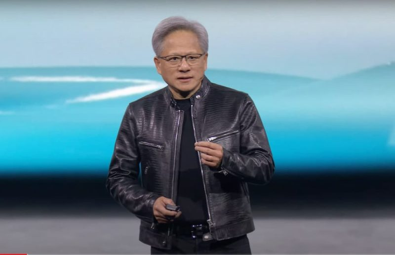
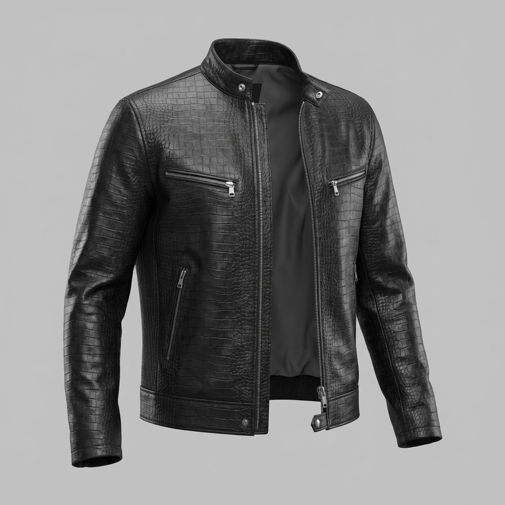

# Jensen Huang Jacket (黄仁勋夹克)

## Prompt

**中文**: 黄仁勋夹克
**English**: Jensen Huang Jacket

## Process

1. **Image Generation**:
    - **Tool**: Meshy AI (Text to Image)
    - **Prompt**: 黄仁勋夹克
    - **Reference Image (Source: Internet)**: 
    
    

    - **Generated Image**:

    

2. **3D Generation**:
    - **Input**: The generated image above.
    - **Tool**: Meshy AI (Image to 3D)

## Files

- **Reference Source**: [Jensen-Huang-Jacket-Reference.jpg](Jensen-Huang-Jacket-Reference.jpg)
- **Generated Image**: [Jensen-Huang-Jacket.png](Jensen-Huang-Jacket.png)
- **Meshy AI Model**: [Jensen-Huang-Jacket.glb](Jensen-Huang-Jacket.glb)

## Preview Link

[View 3D Model (Meshy AI)](Jensen-Huang-Jacket.glb)

