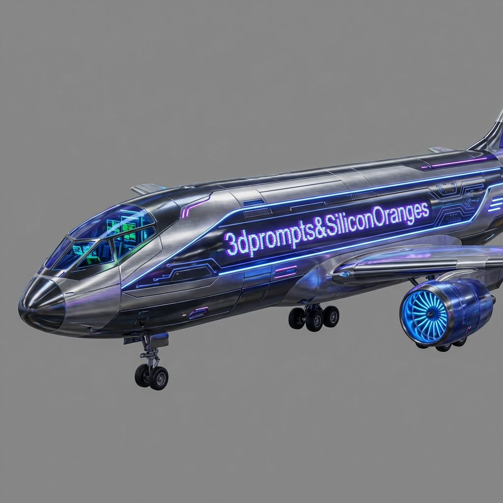

# Cyberpunk Passenger Aircraft

**Author**: [@SiliconOranges](https://x.com/SiliconOranges)

## Prompt

a massive futuristic AI passenger aircraft with a cyberpunk aesthetic, isolated against a plain, solid neutral grey studio background. Even, flat studio lighting to clearly show all details and textures without harsh shadows. The fuselage side is constructed from interlocking dark chrome armor plating and brushed composite materials, accented by intricate glowing blue and purple data conduits and LED strips running along its length. A prominent, glowing neon sign is integrated directly into the central side of the fuselage, reading "3dprompts&SiliconOranges" in a glitchy cyber font. The side profile of the cockpit canopy glows with internal displays. A massive intake engine with a glowing turbine fan is visible mounted under the wing. Landing gear is deployed.

## Process

1. **Generation**:
    - **Tool**: Meshy AI
    - **Method**: Text to 3D
    - **Output**: Direct 3D model generation.
    

## Files

- **Preview Image**: [cyberpunk-aircraft.png](cyberpunk-aircraft.png)
- **3D Model**: [cyberpunk-aircraft.glb](cyberpunk-aircraft.glb)

## Preview Link

[View 3D Model](cyberpunk-aircraft.glb)
