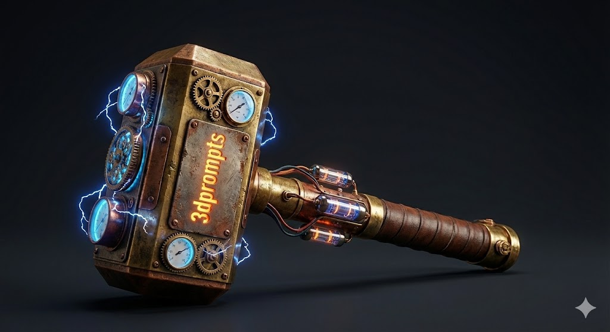

# Thor's Hammer (Mjölnir)

**Author**: Community

## Prompt

生成一个雷神之锤，刻有3dprompts，足够酷炫，具有朋克风格，不需要背景图片

*(Translation: Generate a Thor's hammer, engraved with '3dprompts', cool enough, punk style, no background image)*

## Process

1. **Image Generation**:
    - **Tool**: Gemini
    - **Output**: Generated the preview image.
    

2. **3D Generation**:
    - **Tool**: Tripo3D
    - **Output**: Generated the 3D model.

## Files

- **Preview Image**: [thors-hammer.png](thors-hammer.png)
- **Preview Video**: [thors-hammer.mp4](thors-hammer.mp4)
- **3D Model**: [thors-hammer.glb](thors-hammer.glb)

## Preview Link

[View 3D Model](thors-hammer.glb)

## Description

A punk-style Thor's Hammer engraved with "3dprompts".
